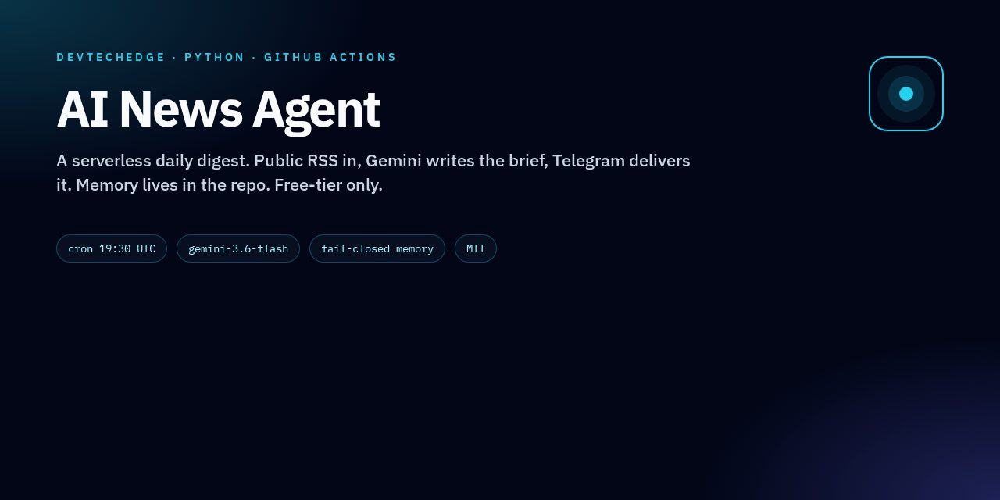
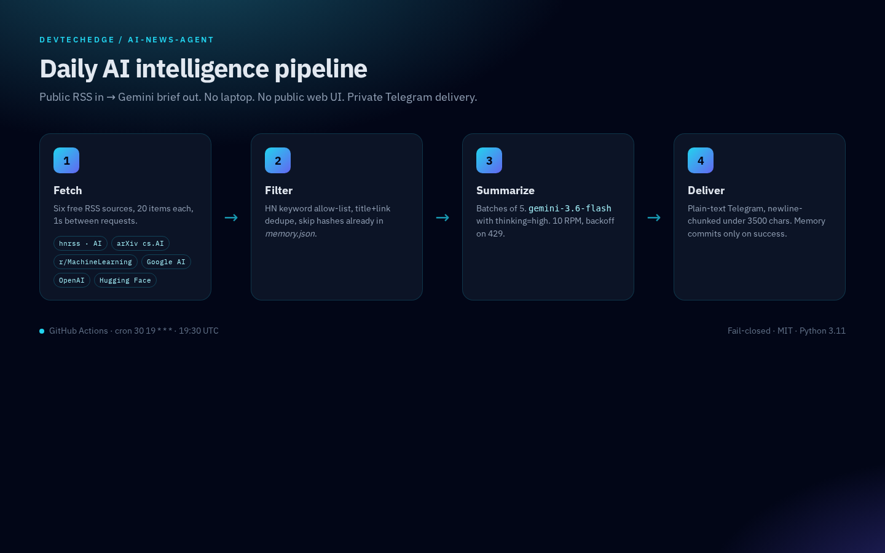
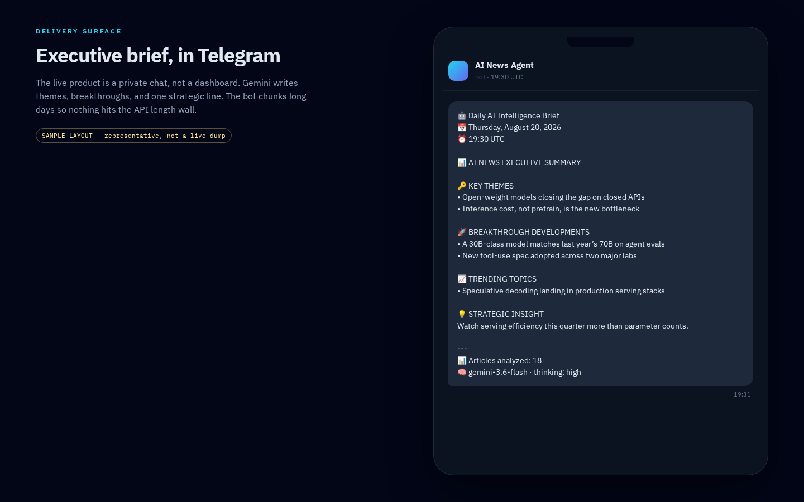
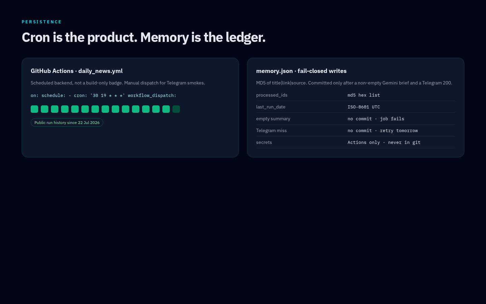

#  AI News Agent

Serverless daily AI digest — GitHub Actions pulls public RSS, Gemini writes the brief, Telegram delivers it.

[](https://github.com/devtechedge/ai-news-agent/actions/workflows/daily_news.yml)
[](https://github.com/devtechedge/ai-news-agent/actions/workflows/daily_news.yml)
[](https://github.com/devtechedge/ai-news-agent/actions/workflows/ci.yml)
[](https://www.python.org/)
[](LICENSE)

---

## Live Demo

**[Daily workflow on GitHub Actions](https://github.com/devtechedge/ai-news-agent/actions/workflows/daily_news.yml)** — scheduled 19:30 UTC, plus manual `workflow_dispatch`.

> **Status:** This is a real scheduled backend, not a client-side mock. There is **no public web UI**. Gemini reads public RSS and writes one short daily brief of the important developments, sent to a **private Telegram chat**. Fork the repo, add three Actions secrets, and the next run is yours. `memory.json` in this public copy stores article hashes only.

---

## Screenshots

<p align="center">
  
</p>

| Pipeline | Telegram brief (sample layout) |
|----------|--------------------------------|
|  |  |

| Schedule + memory |
|-------------------|
|  |

---

## Features

- **Zero laptop, zero bill** — GitHub Actions + Gemini free tier + Telegram Bot API
- **Six public feeds** — HN (AI query), arXiv cs.AI, Reddit r/MachineLearning, Google AI Blog, OpenAI News, Hugging Face Blog
- **In-repo memory** — MD5 of `title|link|source` in `memory.json` so reruns skip duplicates
- **Important-only brief** — Gemini keeps models, launches, landmark research, policy, and big deals; skips recaps and noise
- **One Telegram message** — hard-capped under the Bot API length limit, never split into a thread
- **Rate-limit safe** — one Gemini call per run, 10 RPM cap, exponential backoff on 429, 50-article candidate ceiling
- **Fail-closed** — a Gemini or Telegram miss does **not** commit empty memory and does **not** report success

---

## Tech Stack

| Layer | Technology |
|-------|------------|
| Runtime | Python 3.11 on GitHub Actions |
| Feeds | `feedparser` + `requests` |
| Summarizer | `google-genai` · `gemini-3.6-flash` · thinking level `high` |
| Delivery | Telegram Bot API (plain text) |
| Memory | `memory.json` committed back to `main` |
| CI | GitHub Actions (`compileall` + pytest) |
| License | MIT |

---

## Quick Start

```bash
git clone https://github.com/devtechedge/ai-news-agent.git
cd ai-news-agent
python -m venv .venv && source .venv/bin/activate   # Windows: .venv\Scripts\activate
pip install -r requirements-dev.txt
python -m pytest
```

### Run locally (optional)

```bash
export GEMINI_API_KEY=...
export TELEGRAM_BOT_TOKEN=...
export TELEGRAM_CHAT_ID=...
python agent.py
# Telegram-only smoke:
TEST_TELEGRAM_ONLY=true python agent.py
```

### Wire the daily job

1. Create a Telegram bot via [@BotFather](https://t.me/BotFather) and note the token + chat id.
2. Create a Gemini key in [Google AI Studio](https://aistudio.google.com/app/apikey).
3. Repo **Settings → Secrets and variables → Actions** — add `GEMINI_API_KEY`, `TELEGRAM_BOT_TOKEN`, `TELEGRAM_CHAT_ID`.
4. **Actions → Daily AI News Agent → Run workflow**. Cron is `30 19 * * *` (19:30 UTC).

Schedule, feeds, and RPM caps live in `.github/workflows/daily_news.yml` and `agent.py`.

---

## How it works

```
RSS feeds ──► filter / dedupe ──► Gemini (one brief) ──► one Telegram message
                    │                                        │
                    └──────── memory.json ◄──── commit ──────┘
```

Memory is written only after a non-empty summary **and** a successful Telegram send. CI never calls Gemini.

Threat model: [`SECURITY.md`](SECURITY.md).

---

## License

MIT. See [LICENSE](LICENSE).
